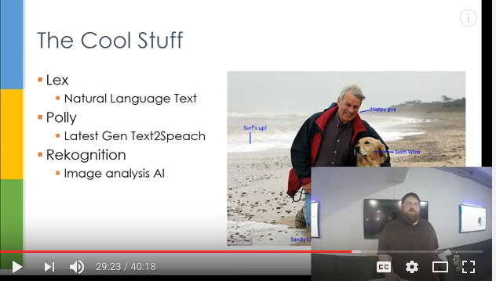

# giving-a-talk

💥 🎉  First off, thanks for wanting to do a talk! 🎉 💥

Below is a guide for giving a talk.

## What should I know before I get started?
We talk about anything relating to web development. This can be languages, frameworks, packages, paradigms, services, etc.. It's pretty open.

💡 We have a board for talk ideas over at waffle.io You can look there for suggestions or ad any you come up with. Just login with GitHub and add an issue with the label "talk idea". https://waffle.io/eugenewebdevs/giving-a-talk

## How Can I Contribute?
To begin you can open an issue on the waffle board or just contact us directly via Meetup.com ✉️

Once you have given your talk it would be great to add your slides and or presentation resources to resources to the [archive repo](https://github.com/eugenewebdevs/archive) in this group.

## Friendly Suggestions
* Give your self plenty of time to prepare. Use https://slides.com/
* Shoot for 30 to 45 min
* Make your presentation web based and available online so we can stream. Use https://slides.com/!!!
* Keep the scope small and relevant to your topic.
* Check the font size you have if you are showing code.
* If you have questions about the venue or just want to test out presentation before just message someone in this Organization
* If you are planning on a live coding demo, be fearless. :godmode:

## Streaming
With the addition of streaming remember to repeat any questions asked so online viewers get the context of your answer.

Keep in mind that we can do a window on top of your slides with you the presenter in it. See example below:

